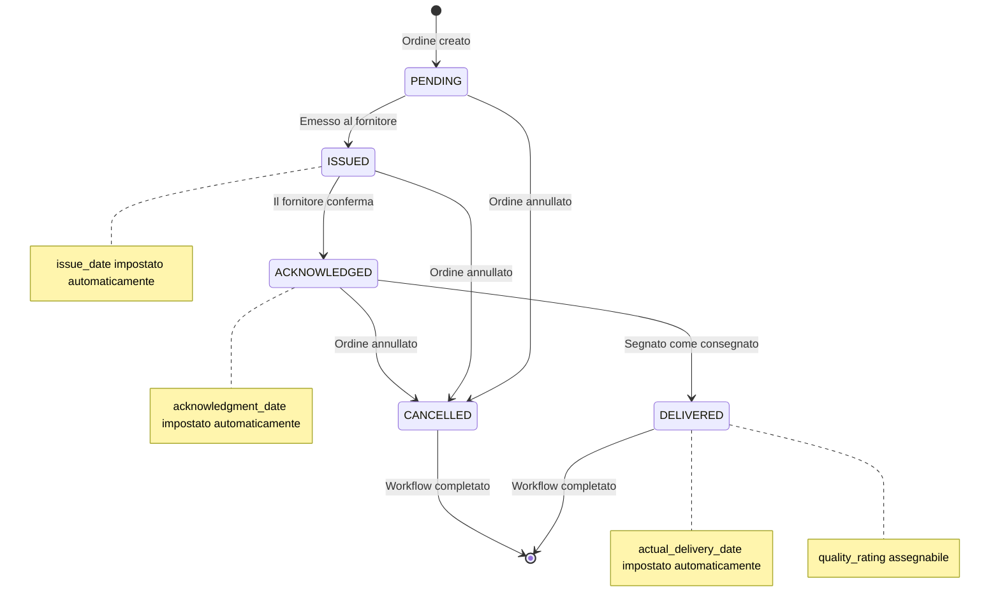
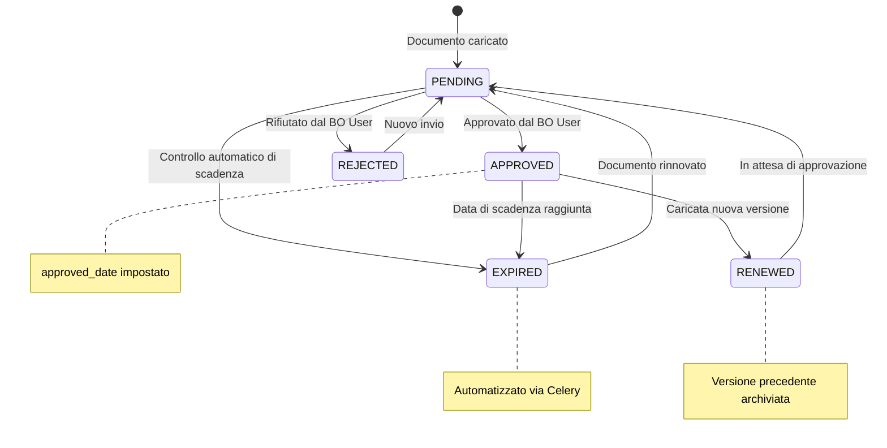
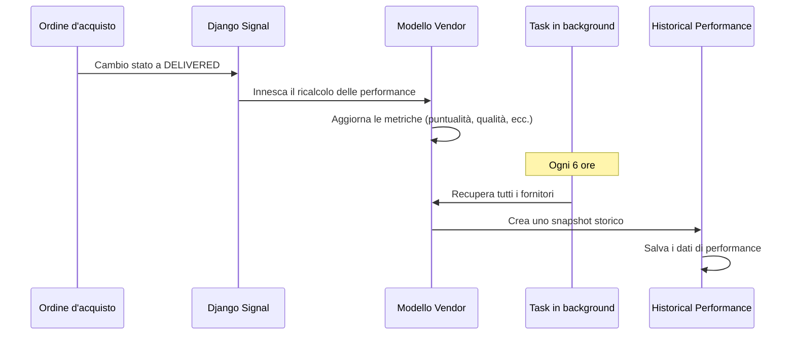
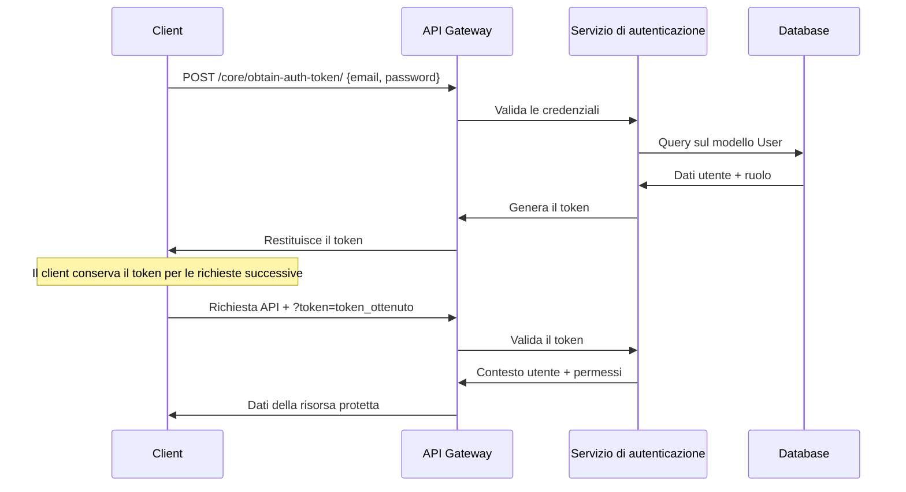

# SRM — Vendor Management System

Applicazione web Django sviluppata per **Fulgard** per gestire l'intero ciclo di vita dei fornitori esterni:
qualifica, documentazione di compliance, competenze/certificazioni, valutazioni e ordini d'acquisto.
Internamente chiamata anche **VMS (Vendor Management System)**. È uno strumento interno di back-office +
self-service (UI/modello di dominio Italian-first), con un'integrazione opzionale verso un sistema legacy interno
chiamato **Embyon**.

[](https://www.djangoproject.com/)
[](https://www.django-rest-framework.org/)
[](https://www.mysql.com/)
[](https://redis.io/)
[](https://docs.celeryq.dev/en/stable/)
[](https://flower.readthedocs.io/en/latest/)
[](https://django-jazzmin.readthedocs.io/)
[](https://github.com/axnsan12/drf-yasg)
[](https://github.com/hynek/argon2-cffi)
[](https://www.docker.com/)

## Stack tecnologico

| Livello | Tecnologia |
|---|---|
| Linguaggio / Framework | Python 3.12, Django 5.0.6, Django REST Framework 3.15 |
| Database | MySQL 8.0 (via `mysqlclient`) |
| Cache / Broker | Redis (`django-redis` per la cache, anche broker di Celery) |
| Task asincroni | Celery 5.4 + Celery Beat (schedule su DB) + Flower (UI di monitoraggio task) |
| Autenticazione | Session auth per la web UI + un'autenticazione custom a token via query-param per la REST API; autenticazione LDAP/Active Directory opzionale tramite un backend ibrido custom |
| Hashing password | Argon2 |
| Admin UI | Django Admin con tema Jazzmin |
| Documentazione API | `drf-yasg` → Swagger UI su `/swagger/` |
| Import/Export | `django-import-export` + `openpyxl` |
| Testing | `pytest` + `pytest-django` + `factory_boy` / `Faker` |
| i18n | Italiano (default), Inglese, Francese |
| Serving in produzione | Apache + `mod_wsgi` (integra l'app direttamente in Apache) |

## App Django

Struttura del progetto: `manage.py` nella root del repo, settings in `config/`, app di business sotto
`vendor_management_system/`.

| App | Responsabilità |
|---|---|
| `core` | Autenticazione a token via query-param, backend di autenticazione LDAP/ibrido, permessi, routing del redirect dashboard |
| `users` | Modello utente custom, sistema di ruoli (`admin`, `bo_user`, `vendor`) |
| `vendors` | Il cuore del sistema: anagrafica fornitori, geografia, categorie, competenze, servizi, contratti, valutazioni |
| `documents` | Ciclo di vita dei documenti di compliance (upload, revisione, scadenza) + dashboard per ruolo |
| `portal` | Portale fornitore self-service (`/portale/`) — documenti, requisiti, richieste di modifica profilo, stato qualifica |
| `purchase_orders` | Macchina a stati degli ordini d'acquisto (PENDING → ISSUED → ACKNOWLEDGED → DELIVERED / CANCELLED) |
| `historical_performances` | Snapshot storici dei KPI fornitore, catturati ogni 6h via Celery Beat |

## Portali web

Punti di accesso basati sul ruolo, dietro un unico login (`/auth/login/`):

| Ruolo | Area di atterraggio | URL |
|---|---|---|
| Admin / Back Office | Django Admin (Jazzmin) | `/admin/` |
| Fornitore (self-service) | Portale Fornitore | `/portale/` |
| Tutti (BO/Admin) | Dashboard analitica fornitori | `/vendors/dashboard/` |

Se `USE_FORNITORI_PREFIX=True` (produzione, dietro Apache/`mod_wsgi`), ogni URL viene inoltre servito sotto un
prefisso `/fornitori` — vedi [docs/URL_PREFIX_CONFIG.md](docs/URL_PREFIX_CONFIG.md).

## Per iniziare

**Setup locale (Docker, consigliato) → [docs/PROJECT_OVERVIEW_AND_LOCAL_SETUP.md](docs/PROJECT_OVERVIEW_AND_LOCAL_SETUP.md)**
Panoramica completa del progetto, gap di configurazione noti, guida passo-passo per avviare l'intero stack
(Django, MySQL, Redis, Celery, Flower) in locale con Docker Compose, e come collegarlo a una copia di dati reali
invece di un database vuoto (§11).

## Documentazione aggiuntiva (`docs/`)

| Documento | Copre |
|---|---|
| [PROJECT_OVERVIEW_AND_LOCAL_SETUP.md](docs/PROJECT_OVERVIEW_AND_LOCAL_SETUP.md) | Cos'è il progetto, mappa dei moduli, setup locale (Docker + nativo), gap di configurazione noti |
| [SISTEMA_OVERVIEW.md](docs/SISTEMA_OVERVIEW.md) | Panoramica funzionale (italiano) |
| [MANUALE_UTENTE_ADMIN.md](docs/MANUALE_UTENTE_ADMIN.md) | Manuale utente amministratore |
| [ANALISI_AREA_FORNITORE.md](docs/ANALISI_AREA_FORNITORE.md) | Analisi del portale self-service fornitore |
| [COMPETENZE_DOCUMENTI.md](docs/COMPETENZE_DOCUMENTI.md) | Note sul dominio competenze/documenti |
| [VENDOR_DASHBOARD.md](docs/VENDOR_DASHBOARD.md) | Dashboard analitica fornitori: filtri, export Excel, test |
| [SCRIPT_IMPORT.md](docs/SCRIPT_IMPORT.md) | Ogni script di import/manutenzione dati: cosa fa, opzioni, ordine di esecuzione |
| [LDAP.md](docs/LDAP.md) | Autenticazione LDAP/Active Directory: configurazione, admin UI, comandi di test |
| [URL_PREFIX_CONFIG.md](docs/URL_PREFIX_CONFIG.md) | Prefisso URL `/fornitori`: sviluppo vs. produzione, configurazione reverse-proxy |
| [PRE_COMMIT.md](docs/PRE_COMMIT.md) | Pre-commit: installazione, hook configurati, dove/quando gira (git commit + hook Claude Code) |
| [CHANGES.md](docs/CHANGES.md) | Log delle modifiche richieste dagli stakeholder |

## Scopo del progetto e panoramica architetturale

### Finalità di business

Il **Vendor Management System (VMS)** è un'applicazione Django pensata per snellire e automatizzare l'intero
processo di gestione del ciclo di vita dei fornitori. Il sistema funge da piattaforma centralizzata per gestire
le relazioni con i fornitori, gli ordini d'acquisto, il tracciamento delle performance e la documentazione di
compliance.

**Obiettivi di business principali:**
- **Gestione del ciclo di vita del fornitore**: operazioni CRUD complete su anagrafica e performance tracking dei fornitori
- **Workflow degli ordini d'acquisto**: workflow automatizzato basato su stati per l'elaborazione degli ordini, dalla creazione alla consegna
- **Performance analytics**: tracciamento in tempo reale e storico delle metriche di performance dei fornitori
- **Gestione della compliance**: tracciamento documentale con alert di scadenza e workflow di approvazione
- **Accesso basato sui ruoli**: sistema utenti multi-livello che riflette i diversi ruoli organizzativi

**Sintesi delle funzionalità principali:**
- **Gestione fornitori**: ciclo di vita completo con metriche di performance
- **Ordini d'acquisto intelligenti**: workflow guidato dallo stato, con transizioni automatizzate
- **Performance tracking in tempo reale**: calcolo automatico delle metriche e dati storici
- **Compliance documentale**: tracciamento scadenze e workflow di approvazione
- **Accesso multi-ruolo**: utenti Admin, Back Office e Fornitore
- **API-first design**: API REST con documentazione completa
- **Elaborazione in background**: task automatizzati per il tracciamento delle performance
- **Audit trail**: tracciamento completo dei cambi di stato degli ordini e dei relativi timestamp

### Architettura ad alto livello

```
┌─────────────────────────────────────────────────────────────────┐
│                        Livello Frontend                         │
│         (interfaccia web + consumer dell'API REST)              │
└─────────────────────┬───────────────────────────────────────────┘
                      │
┌─────────────────────┴───────────────────────────────────────────┐
│                    Livello API Gateway                          │
│      (Django REST Framework + autenticazione a token custom)    │
└─────────────────────┬───────────────────────────────────────────┘
                      │
┌─────────────────────┴───────────────────────────────────────────┐
│                  Livello di logica di business                  │
│  ┌─────────────┬─────────────┬─────────────┬─────────────────┐  │
│  │  Fornitori  │   Ordini    │  Documenti  │   Performance   │  │
│  │ (Vendors)   │ (Workflow)  │(Management) │   (Analytics)   │  │
│  └─────────────┴─────────────┴─────────────┴─────────────────┘  │
└─────────────────────┬───────────────────────────────────────────┘
                      │
┌─────────────────────┴───────────────────────────────────────────┐
│                   Livello di accesso ai dati                    │
│  ┌─────────────┬─────────────┬─────────────┬─────────────────┐  │
│  │    MySQL    │    Redis    │   Celery    │   File Storage  │  │
│  │  Database   │   Cache     │    Queue    │    (Media)      │  │
│  └─────────────┴─────────────┴─────────────┴─────────────────┘  │
└─────────────────────────────────────────────────────────────────┘
```

## Logica di business

### Gestione del ciclo di vita del fornitore

**Logica di business:**
Il sistema gestisce i fornitori lungo un ciclo di vita completo, dalla registrazione alla valutazione delle
performance. Ogni fornitore riceve un codice univoco ed è tracciato su più dimensioni di performance.

**Regole di business principali:**
- Il codice fornitore deve essere alfanumerico maiuscolo (validato via regex)
- Le metriche di performance sono calcolate automaticamente a partire dai dati degli ordini d'acquisto
- Le performance storiche vengono catturate ogni 6 ore tramite task automatizzati
- I fornitori possono essere collegati a un account utente per l'accesso al portale self-service

**Metriche di performance:**
- **On-time Delivery Rate**: percentuale di ordini consegnati entro (o prima) la data prevista
- **Quality Rating Average**: media delle valutazioni su tutti gli ordini completati (scala 1-5)
- **Average Response Time**: tempo intercorso tra l'emissione dell'ordine e la conferma
- **Fulfillment Rate**: percentuale di ordini portati a termine con successo rispetto a quelli annullati

### Macchina a stati degli ordini d'acquisto

**Logica della macchina a stati:**
Gli ordini d'acquisto seguono una rigida macchina a stati, con transizioni automatizzate e applicazione delle
regole di business:

```
PENDING → ISSUED → ACKNOWLEDGED → DELIVERED
    ↓         ↓         ↓
  CANCELLED CANCELLED CANCELLED
```

**Regole di transizione di stato:**

1. **PENDING → ISSUED**
   - Richiede l'assegnazione di un fornitore
   - Imposta automaticamente `issue_date` tramite un Django signal
   - Possibile solo a partire dallo stato PENDING

2. **ISSUED → ACKNOWLEDGED**
   - Deve essere confermato dallo stesso fornitore a cui è stato assegnato l'ordine
   - Imposta automaticamente `acknowledgment_date`
   - Valida l'autorizzazione del fornitore

3. **ACKNOWLEDGED → DELIVERED**
   - Imposta automaticamente `actual_delivery_date`
   - Innesca il ricalcolo delle metriche di performance del fornitore
   - Abilita l'assegnazione della valutazione qualità

4. **Qualsiasi stato → CANCELLED**
   - Può essere annullato da qualsiasi stato non terminale
   - Registra il timestamp di annullamento
   - Influisce sul calcolo del fulfillment rate del fornitore

**Implementazione della logica di business:**
- **Django Signals**: impostazione automatica dei timestamp ai cambi di stato
- **ViewSet actions**: endpoint dedicati per ciascuna transizione di stato
- **Livello di validazione**: validazione delle transizioni di stato nei serializer
- **Audit trail**: tracciamento completo dei cambi di stato con timestamp

### Sistema di performance analytics

**Logica di calcolo automatizzata:**
Il sistema si affida a task Celery in background per monitorare e calcolare in modo continuo le metriche di
performance dei fornitori:

**Task Celery: `record_historical_performance`**
- **Frequenza**: ogni 6 ore (configurabile via Celery Beat)
- **Ambito**: tutti i fornitori attivi nel sistema
- **Dati catturati**: snapshot delle metriche di performance correnti
- **Storage**: record di performance storici per l'analisi dei trend

**Calcolo delle metriche in tempo reale:**
Le metriche di performance vengono ricalcolate automaticamente quando gli ordini d'acquisto cambiano stato:

```python
# Triggered on order delivery
def calculate_on_time_delivery_rate(vendor):
    total_delivered = vendor.orders.filter(status="DELIVERED").count()
    on_time_delivered = vendor.orders.filter(
        status="DELIVERED",
        actual_delivery_date__lte=F("expected_delivery_date"),
    ).count()
    return (
        (on_time_delivered / total_delivered) * 100
        if total_delivered > 0
        else 0
    )
```

### Flusso di gestione documentale

**Ciclo di vita del documento:**
- **Tipi di documento**: requisiti documentali configurabili (DURC, certificazioni ISO, ecc.)
- **Processo di upload**: i fornitori caricano i documenti tramite il portale self-service
- **Workflow di approvazione**: gli utenti back office revisionano e approvano/rifiutano i documenti
- **Tracciamento scadenze**: alert automatici per i documenti prossimi alla scadenza
- **Reportistica di compliance**: viste dashboard per lo stato di compliance su tutti i fornitori

### Relazioni tra le entità

**Entità principali e relazioni:**

```
User (1) ←→ (0..1) Vendor
  ↓
  │ (accesso basato sul ruolo)
  ↓
Vendor (1) ←→ (*) PurchaseOrder
  ↓                    ↓
  │ (performance)      │ (storico)
  ↓                    ↓
HistoricalPerformance  OrderStatusHistory
  ↑
  │ (cattura automatizzata)
  ↑
Vendor (1) ←→ (*) VendorDocument
              ↓
              │ (compliance)
              ↓
            DocumentType
```

**Dettaglio delle relazioni:**

1. **User ↔ Vendor** (One-to-One opzionale)
   - I fornitori possono avere un account utente associato per l'accesso al portale
   - Gli utenti con ruolo 'vendor' devono avere un Vendor collegato
   - Abilita la gestione self-service di documenti e ordini

2. **Vendor ↔ PurchaseOrder** (One-to-Many)
   - Ogni ordine d'acquisto appartiene esattamente a un fornitore
   - Un fornitore può avere più ordini su periodi temporali diversi
   - Relazione a chiave esterna con protezione dalla cancellazione a cascata

3. **Vendor ↔ HistoricalPerformance** (One-to-Many)
   - Snapshot automatizzati delle metriche di performance del fornitore
   - Dati a serie temporale per l'analisi dei trend
   - Catturati ogni 6 ore tramite task Celery

4. **Vendor ↔ VendorDocument** (One-to-Many)
   - Ogni fornitore mantiene più documenti di compliance
   - I documenti hanno uno stato di approvazione e un tracciamento della scadenza
   - Collegati a un DocumentType per la validazione dei requisiti

**Vincoli delle regole di business:**

- **Unicità del codice fornitore**: chiave primaria con validazione regex (alfanumerico maiuscolo)
- **Numero ordine d'acquisto**: identificatore univoco con validazione analoga
- **Logica delle transizioni di stato**: vincoli a livello database garantiscono cambi di stato validi
- **Coerenza delle date**: check constraint garantiscono che le date di consegna siano logicamente coerenti
- **Limiti delle metriche di performance**: validazione che mantiene le metriche entro range validi (0-100% per i tassi, 1-5 per le valutazioni)

## Modello dati dettagliato

### Modelli delle entità principali

#### Modello User (`vendor_management_system.users.models.User`)

**Scopo**: modello User di Django esteso, con accesso basato sui ruoli e associazione al fornitore.

**Campi principali:**
```python
class User(AbstractUser):
    id = CharField(primary_key=True, default=uuid.uuid4, max_length=36)
    name = CharField(max_length=255)  # Replaces first_name/last_name
    email = EmailField(unique=True)  # Primary authentication field
    role = CharField(max_length=20, choices=ROLE_CHOICES, default="bo_user")
    vendor = ForeignKey("vendors.Vendor", null=True, blank=True)
```

**Logica di business:**
- **Gerarchia dei ruoli**: Admin > Back Office User > Vendor User
- **Assegnazione automatica ai gruppi**: gli utenti vengono assegnati automaticamente ai gruppi Django alla creazione
- **Associazione al fornitore**: gli utenti con ruolo vendor devono essere collegati a un record Vendor
- **Metodi di permesso**: metodi integrati per il controllo degli accessi basato sul ruolo

**Metodi principali:**
- `is_admin()`: verifica i privilegi di amministratore
- `can_manage_vendors()`: permesso di modificare i dati fornitore
- `can_view_all_documents()`: accesso ai dati documentali cross-vendor
- `assign_to_group()`: assegnazione automatica al gruppo in base al ruolo

#### Modello Vendor (`vendor_management_system.vendors.models.Vendor`)

**Scopo**: entità centrale che rappresenta le organizzazioni fornitrici, con tracciamento delle performance.

**Campi principali:**
```python
class Vendor(models.Model):
    vendor_code = CharField(max_length=10, primary_key=True)  # Auto-generated
    name = CharField(max_length=255)
    contact_details = TextField()
    address = TextField()

    # Performance Metrics (auto-calculated)
    on_time_delivery_rate = FloatField(0 - 100, null=True)
    quality_rating_avg = FloatField(0 - 5, null=True)
    average_response_time = FloatField(min=0, null=True)  # Hours
    fulfillment_rate = FloatField(0 - 100, null=True)
```

**Regole di business:**
- **Generazione del codice fornitore**: generazione automatica basata su UUID (10 caratteri, maiuscolo)
- **Metriche di performance**: calcolate automaticamente a partire dai dati degli ordini d'acquisto
- **Validazione**: validazione regex per i codici fornitore (solo alfanumerico maiuscolo)
- **Dipendenze soft**: può esistere senza ordini d'acquisto associati

#### Modello Purchase Order (`vendor_management_system.purchase_orders.models.PurchaseOrder`)

**Scopo**: rappresenta gli ordini d'acquisto con workflow a macchina a stati e tracciamento automatico delle date.

**Campi principali:**
```python
class PurchaseOrder(models.Model):
    po_number = CharField(max_length=10, primary_key=True)  # Auto-generated
    vendor = ForeignKey("vendors.Vendor", null=True)
    order_date = DateTimeField(default=timezone.now)
    expected_delivery_date = DateTimeField(null=True)  # Auto-calculated
    actual_delivery_date = DateTimeField(null=True)    # Set on delivery

    items = JSONField()  # Product details and quantities
    quantity = IntegerField(min=1)  # Total quantity (auto-calculated)

    # Workflow fields
    status = CharField(choices=STATUS_CHOICES, default='PENDING')
    issue_date = DateTimeField(null=True)           # Set via signal
    acknowledgment_date = DateTimeField(null=True)  # Set via signal
    quality_rating = FloatField(choices=[(1,1)...(5,5)], null=True)
```

**Workflow di stato:**
```
PENDING → ISSUED → ACKNOWLEDGED → DELIVERED
   ↓        ↓         ↓
CANCELLED CANCELLED CANCELLED
```

**Calcoli automatici:**
- **PO Number**: generazione basata su UUID (10 caratteri, maiuscolo)
- **Expected Delivery**: default a 21 giorni dalla data dell'ordine
- **Total Quantity**: somma delle quantità di tutti gli item nel campo JSON
- **Status Dates**: impostate automaticamente via Django signal ai cambi di stato

#### Modello Historical Performance (`vendor_management_system.historical_performances.models.HistoricalPerformance`)

**Scopo**: cattura dati a serie temporale per l'analisi e il trending delle performance fornitore.

**Campi principali:**
```python
class HistoricalPerformance(models.Model):
    id = CharField(max_length=10, primary_key=True)  # Auto-generated
    vendor = ForeignKey("vendors.Vendor", on_delete=CASCADE)
    date = DateTimeField(default=timezone.now)

    # Snapshot of vendor metrics at capture time
    on_time_delivery_rate = FloatField(0 - 100, null=True)
    quality_rating_avg = FloatField(0 - 5, null=True)
    average_response_time = FloatField(min=0, null=True)
    fulfillment_rate = FloatField(0 - 100, null=True)
```

**Automazione:**
- **Cattura dati**: il task Celery gira ogni 6 ore
- **Sweep completo dei fornitori**: tutti i fornitori catturati in un'unica transazione
- **Trending storico**: abilita l'analisi delle performance nel tempo
- **Integrità dei dati**: transazioni atomiche garantiscono snapshot coerenti

#### Modelli di gestione documentale

**Modello DocumentType** (`vendor_management_system.documents.models.DocumentType`):
```python
class DocumentType(models.Model):
    id = CharField(max_length=10, primary_key=True)
    name = CharField(max_length=100)  # e.g., "DURC", "ISO 9001"
    description = TextField()
    is_required = BooleanField(default=True)
    validity_period_days = IntegerField(null=True)  # Auto-expiry calculation
```

**Modello VendorDocument** (`vendor_management_system.documents.models.VendorDocument`):
```python
class VendorDocument(models.Model):
    id = CharField(max_length=10, primary_key=True)
    vendor = ForeignKey("vendors.Vendor")
    document_type = ForeignKey("DocumentType")
    file = FileField(upload_to="vendor_documents/")

    # Workflow fields
    status = CharField(choices=STATUS_CHOICES, default="PENDING")
    uploaded_date = DateTimeField(auto_now_add=True)
    expiry_date = DateTimeField(null=True)
    approved_date = DateTimeField(null=True)
    approved_by = ForeignKey("users.User", null=True)
```

### Relazioni e vincoli del database

#### Relazioni principali

**1. User ↔ Vendor (One-to-One opzionale)**
```python
# User model
vendor = ForeignKey("vendors.Vendor", null=True, blank=True, related_name="users")

# Business Logic:
- Vendor role users MUST have vendor association
- Multiple users can share the same vendor (team accounts)
- Non-vendor users have null vendor reference
```

**2. Vendor ↔ PurchaseOrder (One-to-Many)**
```python
# PurchaseOrder model
vendor = ForeignKey("vendors.Vendor", on_delete=SET_NULL, null=True)

# Business Logic:
- SET_NULL on vendor deletion preserves order history
- Orders can exist without vendor (draft state)
- Vendor performance calculated from associated orders
```

**3. Vendor ↔ HistoricalPerformance (One-to-Many)**
```python
# HistoricalPerformance model
vendor = ForeignKey("vendors.Vendor", on_delete=CASCADE)

# Business Logic:
- CASCADE deletion removes all historical data
- Time-series relationship for performance trending
- Automated data population via Celery tasks
```

**4. Vendor ↔ VendorDocument (One-to-Many)**
```python
# VendorDocument model
vendor = ForeignKey("vendors.Vendor", on_delete=CASCADE)
document_type = ForeignKey("DocumentType", on_delete=PROTECT)

# Business Logic:
- PROTECT prevents deletion of referenced document types
- Multiple documents per type allowed (renewals)
- Compliance tracking per vendor
```

#### Vincoli e validazione del database

**Vincoli a livello di campo:**
```sql
-- Vendor performance metrics bounds
CHECK (on_time_delivery_rate >= 0 AND on_time_delivery_rate <= 100)
CHECK (quality_rating_avg >= 0 AND quality_rating_avg <= 5)
CHECK (average_response_time >= 0)
CHECK (fulfillment_rate >= 0 AND fulfillment_rate <= 100)

-- Purchase order quantity validation
CHECK (quantity >= 1)

-- Date consistency
CHECK (actual_delivery_date IS NULL OR actual_delivery_date >= order_date)
CHECK (expected_delivery_date IS NULL OR expected_delivery_date >= order_date)
```

**Vincoli delle regole di business:**
```python
# Custom validation in models and serializers
def clean(self):
    # Purchase Order validation
    if self.status == "DELIVERED" and not self.quality_rating:
        raise ValidationError("Quality rating required for delivered orders")

    # User-Vendor consistency
    if self.role == "vendor" and not self.vendor:
        raise ValidationError("Vendor role requires vendor association")

    # Document expiry logic
    if self.expiry_date and self.expiry_date < timezone.now().date():
        raise ValidationError("Document has expired")
```

### Integrità dei dati e performance

#### Strategia di indicizzazione

**Indici primari:**
- `vendor_code` (Primary Key, unique, B-tree)
- `po_number` (Primary Key, unique, B-tree)
- `user.email` (Unique, B-tree)

**Indici di performance:**
```sql
-- Query optimization for common lookups
CREATE INDEX idx_purchase_orders_status ON purchase_orders(status);
CREATE INDEX idx_purchase_orders_vendor_date ON purchase_orders(vendor_id, order_date);
CREATE INDEX idx_historical_performance_vendor_date ON historical_performance(vendor_id, date);
CREATE INDEX idx_vendor_documents_expiry ON vendor_documents(expiry_date) WHERE expiry_date IS NOT NULL;
```

#### Meccanismi di coerenza dei dati

**Django signal per la gestione automatica dei dati:**
```python
@receiver(pre_save, sender=PurchaseOrder)
def set_status_dates(sender, instance, **kwargs):
    """Automatically set timestamps on status changes"""
    try:
        old_instance = sender.objects.get(pk=instance.pk)
        if old_instance.status != instance.status:
            if instance.status == "ISSUED":
                instance.issue_date = timezone.now()
            elif instance.status == "ACKNOWLEDGED":
                instance.acknowledgment_date = timezone.now()
            elif instance.status == "DELIVERED":
                instance.actual_delivery_date = timezone.now()
    except sender.DoesNotExist:
        pass  # New instance, no action needed
```

**Transazioni atomiche per la coerenza dei dati:**
```python
@transaction.atomic
def record_historical_performance():
    """Ensure all vendor performance records are captured consistently"""
    vendors = Vendor.objects.all()
    for vendor in vendors:
        HistoricalPerformance.objects.create(
            vendor=vendor,
            date=timezone.now(),
            on_time_delivery_rate=vendor.on_time_delivery_rate,
            # ... other metrics
        )
```

## Flussi di lavoro e diagrammi di stato

### Ciclo di vita dell'ordine d'acquisto

**Macchina a stati completa dell'ordine d'acquisto:**



**Regole di business del workflow:**

1. **Creazione ordine (→ PENDING)**
   - Il sistema genera un numero PO univoco
   - La data di consegna prevista è impostata a +21 giorni
   - L'ordine può essere creato senza assegnazione del fornitore
   - La quantità totale è calcolata a partire dal campo JSON degli item

2. **Emissione al fornitore (PENDING → ISSUED)**
   - Richiede l'assegnazione del fornitore
   - Imposta automaticamente `issue_date` tramite Django signal
   - Invia una notifica al fornitore (se configurata)
   - Solo utenti admin/back office possono emettere ordini

3. **Conferma del fornitore (ISSUED → ACKNOWLEDGED)**
   - Deve essere confermato dal fornitore assegnato
   - Imposta automaticamente `acknowledgment_date`
   - Gli utenti fornitore possono confermare solo i propri ordini
   - Il tempo di risposta viene calcolato per le metriche del fornitore

4. **Consegna dell'ordine (ACKNOWLEDGED → DELIVERED)**
   - Imposta automaticamente `actual_delivery_date`
   - Abilita l'assegnazione della valutazione qualità (scala 1-5)
   - Innesca il ricalcolo delle performance del fornitore
   - Aggiorna le statistiche di puntualità della consegna

5. **Annullamento dell'ordine (qualsiasi stato → CANCELLED)**
   - Può essere annullato da qualsiasi stato non terminale
   - Influisce sul calcolo del fulfillment rate del fornitore
   - Conserva l'audit trail del motivo di annullamento

### Flusso di gestione documentale

**Processo di approvazione documenti:**



**Regole di business del workflow documentale:**

1. **Upload documento (→ PENDING)**
   - Gli utenti fornitore caricano documenti per il proprio fornitore assegnato
   - Il tipo di documento deve appartenere all'elenco approvato
   - Validazione del file e scansione antivirus
   - Calcolo automatico della scadenza in base al tipo di documento

2. **Processo di approvazione (PENDING → APPROVED/REJECTED)**
   - Solo utenti admin/back office possono approvare
   - L'approvazione imposta `approved_date` e `approved_by`
   - Il rifiuto richiede un motivo/commento
   - Notifiche email inviate al fornitore

3. **Gestione della scadenza (APPROVED → EXPIRED)**
   - Controllo automatico della scadenza via task Celery
   - Notifiche di preavviso inviate prima della scadenza
   - Gestione del periodo di grazia per i rinnovi
   - Reportistica di compliance per i documenti scaduti

### Flusso di performance tracking

**Calcolo automatizzato delle performance:**



**Calcolo delle metriche di performance:**

1. **On-Time Delivery Rate**
   ```python
   delivered_orders = vendor.purchase_orders.filter(status="DELIVERED")
   on_time = delivered_orders.filter(
       actual_delivery_date__lte=F("expected_delivery_date")
   ).count()
   rate = (
       (on_time / delivered_orders.count()) * 100
       if delivered_orders.count() > 0
       else 0
   )
   ```

2. **Quality Rating Average**
   ```python
   rated_orders = vendor.purchase_orders.filter(
       status="DELIVERED", quality_rating__isnull=False
   )
   avg_rating = (
       rated_orders.aggregate(Avg("quality_rating"))["quality_rating__avg"] or 0
   )
   ```

3. **Average Response Time**
   ```python
   acknowledged_orders = vendor.purchase_orders.filter(
       status__in=["ACKNOWLEDGED", "DELIVERED"],
       issue_date__isnull=False,
       acknowledgment_date__isnull=False,
   )
   response_times = [
       (order.acknowledgment_date - order.issue_date).total_seconds() / 3600
       for order in acknowledged_orders
   ]
   avg_response = (
       sum(response_times) / len(response_times) if response_times else 0
   )
   ```

4. **Fulfillment Rate**
   ```python
   total_orders = vendor.purchase_orders.exclude(status="PENDING").count()
   delivered_orders = vendor.purchase_orders.filter(status="DELIVERED").count()
   rate = (delivered_orders / total_orders) * 100 if total_orders > 0 else 0
   ```

## Architettura e pattern delle API

### Design RESTful

**Struttura degli URL basata sulle risorse** (nessun prefisso `/api/`: le route vivono direttamente sotto la root, vedi `config/urls.py`):
```
# Gestione fornitori
GET    /vendors/                            # Elenco fornitori
POST   /vendors/                            # Crea un nuovo fornitore
GET    /vendors/{vendor_code}/              # Recupera un fornitore specifico
PUT    /vendors/{vendor_code}/              # Aggiorna un fornitore
DELETE /vendors/{vendor_code}/              # Elimina un fornitore

# Gestione ordini d'acquisto
GET    /purchase-orders/                    # Elenco ordini
POST   /purchase-orders/                    # Crea un nuovo ordine
GET    /purchase-orders/{po_number}/        # Recupera un ordine specifico
PUT    /purchase-orders/{po_number}/        # Aggiorna un ordine
DELETE /purchase-orders/{po_number}/        # Elimina un ordine

# Azioni di workflow sugli ordini d'acquisto
POST   /purchase-orders/{po_number}/issue/         # Emette l'ordine
POST   /purchase-orders/{po_number}/acknowledge/    # Conferma l'ordine
POST   /purchase-orders/{po_number}/deliver/        # Segna come consegnato
POST   /purchase-orders/{po_number}/cancel/         # Annulla l'ordine
POST   /purchase-orders/{po_number}/rate-quality/   # Assegna la valutazione qualità

# Gestione utenti
GET    /users/                              # Elenco utenti (solo admin)
GET    /users/{email}/                      # Dettaglio utente

# Autenticazione
POST   /core/obtain-auth-token/             # Ottiene il token (email/password)
```

### Flusso di autenticazione e autorizzazione

**Autenticazione a token via query-parameter** (un token DRF statico per utente, letto da `?token=...`
anziché dall'header `Authorization` — non si tratta di JWT):



**Controllo degli accessi basato sui ruoli:**

```python
# Permission Matrix
PERMISSIONS = {
    "admin": {
        "vendors": ["create", "read", "update", "delete"],
        "purchase_orders": [
            "create",
            "read",
            "update",
            "delete",
            "issue",
            "cancel",
        ],
        "documents": ["read", "approve", "reject"],
        "users": ["create", "read", "update", "delete"],
    },
    "bo_user": {
        "vendors": ["create", "read", "update"],
        "purchase_orders": ["create", "read", "update", "issue"],
        "documents": ["read", "approve", "reject"],
        "users": ["read"],
    },
    "vendor": {
        "vendors": ["read"],  # Own vendor only
        "purchase_orders": [
            "read",
            "acknowledge",
            "deliver",
        ],  # Own orders only
        "documents": ["create", "read", "update"],  # Own documents only
        "users": [],
    },
}
```

### Gestione degli errori e pattern di risposta

**Risposte di errore standardizzate:**
```json
{
  "error": {
    "code": "VALIDATION_ERROR",
    "message": "Invalid data provided",
    "details": {
      "field_name": ["This field is required."],
      "vendor_code": ["Vendor with this code already exists."]
    },
    "timestamp": "2025-10-17T10:30:00Z"
  }
}
```

**Uso degli status code HTTP:**
- `200 OK`: operazioni GET, PUT completate con successo
- `201 Created`: operazioni POST completate con successo
- `204 No Content`: operazioni DELETE completate con successo
- `400 Bad Request`: errori di validazione, violazioni delle regole di business
- `401 Unauthorized`: autenticazione richiesta o fallita
- `403 Forbidden`: permessi insufficienti
- `404 Not Found`: risorsa non esistente
- `409 Conflict`: conflitti di stato (es. transizione di stato non valida)
- `500 Internal Server Error`: errori del server non previsti

## Task in background e automazione

### Configurazione Celery

**Architettura delle code:**
```python
# Celery Settings (config/settings.py)
CELERY_BROKER_URL = os.getenv("CELERY_BROKER_URL", "redis://localhost:6379/0")
CELERY_RESULT_BACKEND = CELERY_BROKER_URL
CELERY_ACCEPT_CONTENT = ["json"]
CELERY_TASK_SERIALIZER = "json"
CELERY_RESULT_SERIALIZER = "json"
CELERY_TIMEZONE = "Europe/Rome"

# Periodic Task Schedule
CELERY_BEAT_SCHEDULE = {
    "record-historical-performance": {
        "task": "vendor_management_system.historical_performances.tasks.record_historical_performance",
        "schedule": crontab(minute=0, hour="*/6"),  # Every 6 hours
    },
    "check-document-expiry": {
        "task": "vendor_management_system.documents.tasks.check_expiring_documents",
        "schedule": crontab(minute=0, hour=9),  # Daily at 9 AM
    },
}
```

### Task automatizzati

**1. Registrazione delle performance storiche:**
```python
@shared_task
def record_historical_performance():
    """Capture performance snapshots for all vendors every 6 hours"""
    with transaction.atomic():
        vendors = Vendor.objects.all()
        for vendor in vendors:
            HistoricalPerformance.objects.create(
                vendor=vendor,
                date=timezone.now(),
                on_time_delivery_rate=vendor.on_time_delivery_rate,
                quality_rating_avg=vendor.quality_rating_avg,
                average_response_time=vendor.average_response_time,
                fulfillment_rate=vendor.fulfillment_rate,
            )
```

**2. Monitoraggio della scadenza documenti:**
```python
@shared_task
def check_expiring_documents():
    """Check for documents expiring within warning period"""
    warning_date = timezone.now().date() + timedelta(days=30)
    expiring_docs = VendorDocument.objects.filter(
        status="APPROVED",
        expiry_date__lte=warning_date,
        expiry_date__gte=timezone.now().date(),
    )

    for doc in expiring_docs:
        send_expiry_warning_email.delay(doc.id)
```

### Monitoraggio dei task

**Dashboard Flower:**
- Monitoraggio dei task in tempo reale su `http://localhost:5555`
- Statistiche di esecuzione e metriche di performance dei task
- Monitoraggio dello stato di salute dei worker
- Investigazione e gestione dei retry dei task falliti

## Sicurezza e protezione dei dati

### Sicurezza dell'autenticazione

**Sicurezza delle password:**
- **Hashing Argon2**: algoritmo di hashing delle password standard di settore
- **Validazione password**: requisiti di complessità e controllo delle password comuni
- **Token statici**: l'autenticazione REST usa un token DRF (`rest_framework.authtoken`) statico per utente,
  letto da query-param invece che dall'header `Authorization`; il token non ha una scadenza automatica e resta
  valido finché non viene esplicitamente rigenerato/revocato lato server
- **Rate limiting**: protezione degli endpoint API contro attacchi brute-force

**Gestione della sessione:**
- **Storage sicuro del token**: buone pratiche per la gestione del token lato client
- **Nessun refresh automatico**: a differenza di un flusso JWT, non esiste un meccanismo di refresh — il token
  resta valido finché non viene rigenerato o eliminato esplicitamente
- **Invalidazione della sessione**: revoca immediata del token in caso di eventi di sicurezza

### Framework di autorizzazione

**Role-Based Access Control (RBAC):**
```python
class IsVendorUser(BasePermission):
    """Permission class for vendor users - access only to own data"""

    def has_permission(self, request, view):
        return (
            request.user.role == "vendor" and request.user.vendor is not None
        )

    def has_object_permission(self, request, view, obj):
        if hasattr(obj, "vendor"):
            return obj.vendor == request.user.vendor
        return False


class IsBackOfficeOrAdmin(BasePermission):
    """Permission class for back office and admin users"""

    def has_permission(self, request, view):
        return request.user.role in ["admin", "bo_user"]
```

### Misure di protezione dei dati

**Validazione dei dati:**
- **Input sanitization**: prevenzione XSS tramite corretta validazione nei serializer
- **Protezione da SQL injection**: parametrizzazione automatica delle query dell'ORM Django
- **Sicurezza dell'upload file**: validazione del tipo di file e scansione antivirus
- **Validazione dei campi**: applicazione delle regole di business a livello di model e API

**Audit trail:**
- **Tracciamento dei cambi di stato**: registrazione automatica dei timestamp per tutte le transizioni di stato
- **Logging delle azioni utente**: audit trail completo delle azioni utente e delle modifiche ai dati
- **Data retention**: periodi di conservazione configurabili per i dati storici

## Architettura di deployment

Il progetto ha due configurazioni di deployment reali, entrambe diverse da un'ipotetica architettura generica
a container (niente PostgreSQL, niente coppia dedicata `gunicorn` + `nginx`):

- **Locale**: Docker Compose con i servizi `django`, `mysql`, `redis`, `celeryworker`, `celerybeat`, `flower`.
  Il container `django` serve le richieste con il dev server integrato di Django (Werkzeug), non c'è un
  container `nginx` separato né `gunicorn` nel percorso di richiesta. Procedura completa in
  [docs/PROJECT_OVERVIEW_AND_LOCAL_SETUP.md, §8](docs/PROJECT_OVERVIEW_AND_LOCAL_SETUP.md).
- **Produzione**: una VM Ubuntu nativa (non containerizzata) che serve l'app con **Apache + `mod_wsgi`**,
  integrando il processo Django direttamente nei worker di Apache. Il database MySQL è un server esterno alla
  VM, mentre Redis gira in locale sulla VM per cache e broker di Celery. Dettagli in
  [docs/PROJECT_OVERVIEW_AND_LOCAL_SETUP.md, §7 punto 7 e §11](docs/PROJECT_OVERVIEW_AND_LOCAL_SETUP.md).

Per i dettagli operativi (variabili d'ambiente, checklist di setup, troubleshooting) fare riferimento a quel
documento: l'obiettivo di questa sezione è l'architettura applicativa, non il runbook operativo.

### Considerazioni sulla scalabilità

Alcune linee guida generali, valide indipendentemente dalla topologia di deployment scelta:

**Ottimizzazione delle performance:**
- **Indicizzazione del database**: indici ottimizzati per i pattern di query più comuni (vedi la sezione sul modello dati)
- **Ottimizzazione delle query**: uso di `select_related` e `prefetch_related` per evitare problemi N+1
- **Strategia di cache**: cache Redis per i dati fornitore acceduti più di frequente
- **Ottimizzazione degli asset statici**: eventuale CDN per la distribuzione degli static file

**Monitoring e logging:**
- **Application monitoring**: health check e metriche di performance
- **Error tracking**: logging centralizzato degli errori e alerting
- **Performance monitoring**: analisi delle performance delle query sul database
- **Security monitoring**: rilevamento e alerting sui fallimenti di autenticazione

**Possibili evoluzioni future** (considerazioni, non architettura già esistente): load balancing tra più
istanze dell'applicazione se il carico lo richiedesse, read replica del database per le query di analytics più
pesanti, clustering Redis per l'alta affidabilità della cache, e scaling dinamico dei worker Celery in base alla
profondità delle code.

## API

Riferimento interattivo completo: `/swagger/` (Swagger UI via `drf-yasg`). L'autenticazione per l'API è un token
via query-parameter, ottenuto tramite `POST /core/obtain-auth-token/` (email/password) e passato come
`?token=...` nelle richieste successive.
