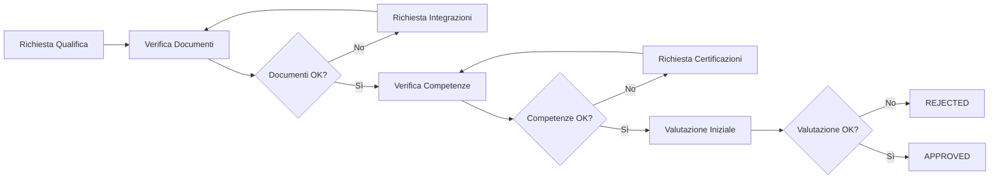

# 🏢 Sistema di Gestione Fornitori (SRM)

## Panoramica Sistema

Il **Supplier Relationship Management (SRM)** è un sistema completo per la gestione dei fornitori, della documentazione e delle performance aziendali. Il sistema fornisce funzionalità avanzate per la qualifica dei fornitori, la gestione documentale, il monitoraggio delle certificazioni e la valutazione delle prestazioni.

---

## 📋 Indice

1. [Architettura del Sistema](#architettura-del-sistema)
2. [Ruoli e Permessi](#ruoli-e-permessi)
3. [Moduli Funzionali](#moduli-funzionali)
4. [Flussi di Lavoro Principali](#flussi-di-lavoro-principali)
5. [Dashboard e Interfacce](#dashboard-e-interfacce)

---

## 🏗️ Architettura del Sistema

### Stack Tecnologico

- **Backend**: Django 5.0.6 + Django REST Framework
- **Database**: PostgreSQL
- **Cache**: Redis
- **Task Queue**: Celery + Celery Beat
- **Autenticazione**: JWT Token-based
- **API Documentation**: OpenAPI/Swagger (drf-yasg)
- **Admin Interface**: Django Admin con Jazzmin

### Applicazioni Django

Il sistema è organizzato in moduli applicativi specializzati:

| Modulo | Descrizione | Responsabilità Principali |
|--------|-------------|---------------------------|
| **core** | Fondamenta del sistema | Autenticazione JWT, permessi, decoratori, utilities comuni |
| **users** | Gestione utenti | Modello utente personalizzato, gestione ruoli, associazione fornitori |
| **vendors** | Gestione fornitori | Anagrafica fornitori, categorie, competenze, valutazioni performance |
| **documents** | Gestione documentale | Tipi documento, caricamento, verifica, scadenze |
| **purchase_orders** | Ordini di acquisto | Creazione, gestione flusso, tracking consegne |
| **historical_performances** | Tracking performance | Registrazione storica metriche, analisi trend |

---

## 👥 Ruoli e Permessi

### Struttura Ruoli

Il sistema implementa un modello **Role-Based Access Control (RBAC)** con tre livelli gerarchici:

```
┌─────────────────────────────────────┐
│         AMMINISTRATORE              │  ← Accesso completo
│  (Admin / Superuser)                │
└─────────────────────────────────────┘
              ↓
┌─────────────────────────────────────┐
│      UTENTE BACK OFFICE             │  ← Gestione operativa
│  (Back Office User)                 │
└─────────────────────────────────────┘
              ↓
┌─────────────────────────────────────┐
│         FORNITORE                   │  ← Accesso limitato ai propri dati
│  (Vendor User)                      │
└─────────────────────────────────────┘
```

### 1. Amministratore (Admin)

**Ruolo**: Gestione completa del sistema

**Permessi**:
- ✅ Accesso completo all'admin Django
- ✅ Gestione utenti (creazione, modifica, eliminazione)
- ✅ Configurazione sistema (tipi documento, categorie, competenze)
- ✅ Gestione fornitori (CRUD completo)
- ✅ Approvazione/rifiuto documenti
- ✅ Gestione ordini di acquisto (creazione, modifica, cancellazione)
- ✅ Visualizzazione report e statistiche avanzate
- ✅ Configurazione task schedulati
- ✅ Accesso a tutti i dati di sistema

**Dashboard**: `/documents/admin/`

**Funzionalità Esclusive**:
- Gestione configurazioni globali
- Assegnazione ruoli e permessi
- Export dati completi
- Audit log completo

---

### 2. Utente Back Office (BO User)

**Ruolo**: Gestione operativa quotidiana

**Permessi**:
- ✅ Gestione anagrafica fornitori (creazione, modifica)
- ✅ Caricamento e verifica documenti fornitori
- ✅ Creazione e gestione ordini di acquisto
- ✅ Approvazione/rifiuto documentazione
- ✅ Visualizzazione dashboard operativa
- ✅ Monitoraggio scadenze documenti
- ✅ Generazione report operativi
- ✅ Gestione comunicazioni con fornitori
- ⛔ NO configurazioni di sistema
- ⛔ NO gestione utenti
- ⛔ NO eliminazione fornitori

**Dashboard**: `/documents/backoffice/`

**Funzionalità Principali**:
- Gestione qualifica fornitori
- Verifica conformità documentale
- Tracking scadenze e rinnovi
- Valutazione performance
- Comunicazioni operative

---

### 3. Fornitore (Vendor User)

**Ruolo**: Accesso self-service per fornitori esterni

**Permessi**:
- ✅ Visualizzazione propri dati anagrafici (sola lettura)
- ✅ Caricamento documenti richiesti
- ✅ Aggiornamento documenti in scadenza
- ✅ Visualizzazione stato qualifica
- ✅ Visualizzazione ordini di acquisto propri
- ✅ Conferma/aggiornamento ordini
- ✅ Visualizzazione proprie valutazioni
- ⛔ NO accesso dati altri fornitori
- ⛔ NO modifica anagrafica (solo richieste)
- ⛔ NO accesso sezioni amministrative

**Dashboard**: `/documents/portal/`

**Funzionalità Principali**:
- Portal self-service
- Upload documenti
- Tracking stato qualifica
- Gestione ordini
- Storico interazioni

---

## 🔧 Moduli Funzionali

### 1. 📁 Gestione Anagrafica Fornitori

**Obiettivo**: Mantenere un database completo e strutturato dei fornitori

**Funzionalità Chiave**:

#### Dati Anagrafici Base
- Codice fornitore (auto-generato)
- Ragione sociale
- Partita IVA / Codice Fiscale
- Indirizzo (sede legale, operativa)
- Contatti (email, telefono, riferimento)
- Sito web

#### Classificazione e Categorizzazione
- **Categorie Merceologiche**: Classificazione gerarchica (es. Servizi > Consulenza > Sicurezza)
- **Tipo Fornitore**: Società, Professionista, Dipendente, ecc.
- **Tipologia Servizio**: Servizi specifici offerti
- **Livello di Rischio**: Basso, Medio, Alto (assegnazione automatica o manuale)

#### Competenze e Qualifiche
- **Titoli di Studio**: Titoli professionali e accademici
- **Competenze Tecniche**: Catalogo competenze con sistema gerarchico
- **Certificazioni**: ISO 9001, ISO 14001, ISO 45001, SA8000, ecc.
- **Zone di Competenza**: Aree geografiche di operatività

#### Dati Contrattuali
- Stato contrattuale
- Date inizio/fine contratto
- Termini contrattuali
- Persona di riferimento contrattuale

#### Metriche di Performance
- Tasso di consegna puntuale
- Valutazione qualità media
- Tempo di risposta medio
- Tasso di adempimento
- Valutazione finale aggregata (Da Valutare, Negativo, Positivo, Molto Positivo)

**Accesso**:
- Admin: CRUD completo
- BO User: Creazione e modifica
- Vendor: Sola lettura propri dati

---

### 2. 📄 Gestione Documentale

**Obiettivo**: Gestire il ciclo di vita completo della documentazione fornitori

#### Tipi di Documento Supportati

| Categoria | Esempi | Obbligatorietà | Scadenza |
|-----------|--------|----------------|----------|
| **Legale/Amministrativo** | DURC, Visura Camerale, Atto Costitutivo, Antimafia | Obbligatori | 120-180 giorni |
| **Finanziario** | Bilanci, Certificazioni Bancarie | Varia | Annuale |
| **Sicurezza** | DVR, POS, DUVRI, Attestati Formazione | Obbligatori | 365 giorni |
| **Qualità** | ISO 9001, ISO 14001, ISO 45001 | Opzionali | 3 anni |
| **Assicurativo** | RC Professionale, RC Operativa, INAIL | Obbligatori | 365 giorni |
| **Certificazioni** | SA8000, ISO 50001 | Opzionali | Varia |
| **Tecnico** | Referenze, Organigrammi, Attrezzature | Opzionali | Annuale |

#### Funzionalità Documentali

**Per Back Office**:
- ✅ Definizione tipi documento (codice, categoria, obbligatorietà)
- ✅ Configurazione scadenze e alert
- ✅ Verifica e approvazione documenti
- ✅ Richiesta integrazioni/modifiche
- ✅ Gestione template e istruzioni
- ✅ Monitoring scadenze centralizzato
- ✅ Report conformità documentale

**Per Fornitori**:
- ✅ Caricamento documenti richiesti
- ✅ Visualizzazione stato documenti
- ✅ Alert automatici pre-scadenza
- ✅ Storico versioni documenti
- ✅ Download template

#### Stati Documento
1. **PENDING**: In attesa di caricamento
2. **UPLOADED**: Caricato, in attesa verifica
3. **APPROVED**: Approvato e valido
4. **REJECTED**: Respinto (con motivazione)
5. **EXPIRED**: Scaduto

#### Sistema di Alert
- 🔴 **Scaduto**: Documento oltre la data di scadenza
- 🟠 **In scadenza**: Entro i giorni di preavviso configurati
- 🟢 **Valido**: Documento approvato e in corso di validità
- ⚪ **Mancante**: Documento obbligatorio non caricato

**Workflow Approvazione**:
```
Fornitore → Upload → BO Verifica → Approvazione/Rifiuto → Notifica Fornitore
```

---

### 3. 🎯 Sistema di Valutazione Fornitori

**Obiettivo**: Valutare oggettivamente le performance dei fornitori

#### Categorie di Valutazione

Il sistema supporta diverse schede di valutazione specializzate:

1. **Valutazione Commerciale** (COMM)
   - Condizioni economiche
   - Flessibilità
   - Rapporto qualità/prezzo

2. **Valutazione Servizi Consulting** (CONS)
   - Qualità consulenza
   - Competenza tecnica
   - Rispetto tempi

3. **Valutazione Servizi FCB** (FCB)
   - Efficienza servizio
   - Gestione emergenze
   - Comunicazione

4. **Valutazione Servizi Medici** (MED)
   - Professionalità
   - Attrezzature
   - Tempestività

5. **Valutazione Prodotti Non Tecnologici** (PROD_NONTEC)
   - Qualità prodotto
   - Conformità specifiche
   - Packaging

6. **Valutazione Prodotti Tecnologici** (PROD_TEC)
   - Performance tecniche
   - Innovazione
   - Supporto tecnico

#### Scala di Valutazione
- **1**: Scarso
- **2**: Insufficiente
- **3**: Non sufficiente
- **4**: Al limite della sufficienza
- **5**: Sufficiente
- **6**: Buono
- **7**: Ottimo
- **8**: Eccellente

#### Criterio di Valutazione
Ogni categoria ha criteri specifici configurabili:
- Codice criterio univoco
- Nome e descrizione
- Peso nel calcolo finale
- Soglie di accettabilità

**Calcolo Score Finale**:
```
Score Finale = Σ(Punteggio Criterio × Peso) / Σ(Pesi)
```

**Classificazione Finale**:
- **DA VALUTARE**: Nessuna valutazione
- **NEGATIVO**: Score < 4
- **POSITIVO**: Score 4-6
- **MOLTO POSITIVO**: Score > 6

---

### 4. 🏅 Sistema di Qualifica Fornitori

**Obiettivo**: Gestire il processo di qualifica e mantenimento dello stato fornitore

#### Stati di Qualifica
- **PENDING**: In attesa di qualifica
- **APPROVED**: Qualificato e operativo
- **REJECTED**: Non qualificato

#### Requisiti di Qualifica

**Documentazione Obbligatoria**:
- ✅ Tutti i documenti marcati come "obbligatori" per la categoria
- ✅ Documenti in stato APPROVED
- ✅ Documenti non scaduti

**Competenze Richieste**:
- ✅ Competenze obbligatorie per la categoria possedute
- ✅ Certificazioni richieste valide
- ✅ Verifiche completate

**Performance Minime**:
- ✅ Score qualifica ≥ threshold configurato
- ✅ Nessuna valutazione negativa recente
- ✅ Audit superati

#### Processo di Qualifica



#### Mantenimento Qualifica
- 🔄 **Rinnovo Annuale**: Verifica documentazione
- 📊 **Monitoraggio Continuo**: Performance e conformità
- ⏰ **Audit Periodici**: Scadenza configurabile
- 📈 **Valutazioni Progressive**: Tracking storico

**Dashboard Qualifica**:
- Stato generale
- Documenti mancanti/scaduti
- Competenze da rinnovare
- Prossimi audit
- Score qualifica attuale

---

### 5. 📦 Gestione Ordini di Acquisto

**Obiettivo**: Gestire il ciclo di vita degli ordini di acquisto

#### Stati Ordine
1. **PENDING**: Creato, non ancora emesso
2. **ISSUED**: Emesso al fornitore
3. **ACKNOWLEDGED**: Confermato dal fornitore
4. **DELIVERED**: Consegnato
5. **CANCELLED**: Annullato

#### Dati Ordine
- Numero ordine (univoco)
- Fornitore
- Data emissione
- Data conferma
- Data consegna prevista/effettiva
- Importo
- Articoli/Servizi
- Note e allegati

#### Workflow Ordine
```
BO: Crea → BO: Emette → Fornitore: Conferma → Fornitore: Consegna → BO: Verifica
```

#### Tracking Performance
Automaticamente registra:
- On-time delivery rate
- Tempo di risposta
- Tasso di adempimento
- Problemi riscontrati

**Integrazioni**:
- Signal Django per aggiornamenti automatici stato
- Celery tasks per reminder e escalation
- Notifiche email automatiche

---

### 6. 📊 Tracking Performance Storico

**Obiettivo**: Mantenere uno storico delle performance per analisi trend

#### Metriche Tracciate
- **On-Time Delivery Rate**: % consegne puntuali
- **Quality Rating**: Valutazione media qualità
- **Response Time**: Tempo medio di risposta
- **Fulfillment Rate**: % ordini completati con successo

#### Registrazione Automatica
- **Celery Beat**: Task schedulato ogni 6 ore
- **Snapshot Performance**: Registra stato corrente
- **Calcolo Trend**: Media mobile su periodi configurabili

#### Analisi Disponibili
- Trend performance nel tempo
- Confronto tra fornitori
- Identificazione deterioramenti
- Report periodici automatici

**Utilizzo**:
```python
# Recupera performance storico
performances = vendor.historical_performances.filter(
    record_date__gte=last_year
).order_by('record_date')

# Calcola trend
trend = calculate_trend(performances, metric='quality_rating')
```

---

## 🔄 Flussi di Lavoro Principali

### Flusso 1: Onboarding Nuovo Fornitore

**Attori**: BO User, Fornitore

```
1. BO User crea anagrafica fornitore
   ├─ Inserisce dati base
   ├─ Assegna categoria
   └─ Definisce competenze richieste

2. BO User crea account utente fornitore
   ├─ Ruolo: Vendor
   ├─ Associazione al fornitore
   └─ Invio credenziali

3. Fornitore accede al portal
   ├─ Visualizza documenti richiesti
   ├─ Carica documentazione
   └─ Compila schede competenze

4. BO User verifica documentazione
   ├─ Controlla conformità
   ├─ Approva o richiede modifiche
   └─ Monitora completamento

5. Sistema valuta qualifica
   ├─ Verifica completamento
   ├─ Calcola score iniziale
   └─ Assegna stato APPROVED/PENDING

6. Fornitore operativo
   ├─ Può ricevere ordini
   ├─ Dashboard attiva
   └─ Monitoring attivo
```

---

### Flusso 2: Gestione Scadenze Documenti

**Attori**: Sistema, BO User, Fornitore

```
1. Sistema monitora scadenze (Celery Beat)
   ├─ Verifica documenti in scadenza
   ├─ Identifica documenti scaduti
   └─ Genera lista alert

2. Sistema invia notifiche
   ├─ Email a fornitore (30 giorni prima)
   ├─ Alert dashboard fornitore
   └─ Notifica BO User

3. Fornitore carica nuovo documento
   ├─ Upload versione aggiornata
   ├─ Indicazione date validità
   └─ Note aggiuntive

4. BO User verifica documento
   ├─ Controllo validità
   ├─ Confronto con precedente
   └─ Approvazione

5. Sistema aggiorna stato
   ├─ Documento APPROVED
   ├─ Rimozione alert
   └─ Aggiornamento qualifica fornitore
```

---

### Flusso 3: Creazione e Gestione Ordine

**Attori**: BO User, Fornitore

```
1. BO User crea ordine
   ├─ Seleziona fornitore qualificato
   ├─ Inserisce dettagli ordine
   └─ Stato: PENDING

2. BO User emette ordine
   ├─ Validazione dati
   ├─ Generazione numero ordine
   ├─ Invio a fornitore
   └─ Stato: ISSUED

3. Fornitore riceve e conferma
   ├─ Visualizza in dashboard
   ├─ Conferma/Richiede modifiche
   └─ Stato: ACKNOWLEDGED

4. Fornitore gestisce consegna
   ├─ Aggiorna stato avanzamento
   ├─ Carica documenti di trasporto
   └─ Segnala completamento
   └─ Stato: DELIVERED

5. Sistema registra performance
   ├─ Calcola on-time delivery
   ├─ Aggiorna metriche fornitore
   └─ Storicizza dati
```

---

### Flusso 4: Valutazione Periodica Fornitore

**Attori**: BO User, Sistema

```
1. BO User avvia valutazione
   ├─ Seleziona fornitore
   ├─ Sceglie categoria valutazione
   └─ Accede alla scheda

2. BO User compila criteri
   ├─ Assegna punteggi 1-8
   ├─ Aggiunge note
   └─ Salva valutazione

3. Sistema calcola score
   ├─ Applica pesi criteri
   ├─ Calcola media ponderata
   └─ Determina valutazione finale

4. Sistema aggiorna stato fornitore
   ├─ Aggiorna vendor_final_evaluation
   ├─ Registra in storico
   └─ Notifica se cambio stato

5. Dashboard aggiornata
   ├─ Nuovi dati visibili
   ├─ Trend aggiornati
   └─ Report generati
```

---

## 📱 Dashboard e Interfacce

### 1. Dashboard Amministratore

**URL**: `/documents/admin/`

**Sezioni Principali**:

#### Overview Generale
- 📊 **Statistiche Sistema**
  - Totale fornitori (per stato)
  - Documenti da verificare
  - Ordini aperti
  - Alert attivi

#### Gestione Fornitori
- 👥 Lista completa fornitori
- 🔍 Ricerca avanzata multi-criterio
- 📈 Grafici performance aggregate
- ⚙️ Azioni bulk (export, notifiche)

#### Gestione Documentale
- 📄 Coda verifica documenti
- ⏰ Timeline scadenze
- 📋 Checklist conformità
- 🔔 Centro notifiche

#### Configurazione Sistema
- 🏷️ Tipi documento
- 📁 Categorie fornitori
- 🎓 Catalogo competenze
- 📊 Criteri valutazione
- 👤 Gestione utenti

#### Report e Analytics
- 📊 Dashboard KPI
- 📈 Trend performance
- 📉 Analisi conformità
- 📑 Export dati

---

### 2. Dashboard Back Office

**URL**: `/documents/backoffice/`

**Sezioni Principali**:

#### Task Operativi
- ✅ **To-Do List**
  - Documenti da approvare
  - Fornitori da qualificare
  - Ordini da processare
  - Scadenze imminenti

#### Gestione Fornitori
- 📝 Creazione/modifica anagrafica
- 🔄 Aggiornamento dati
- 📊 Monitoraggio qualifica
- 💬 Comunicazioni

#### Gestione Documenti
- 📥 Verifica documenti caricati
- ✅ Approvazioni/rifiuti
- 📤 Richieste integrazioni
- 📅 Calendario scadenze

#### Gestione Ordini
- ➕ Creazione ordini
- 🔄 Tracking stato
- 📝 Aggiornamenti
- 📊 Report consegne

#### Valutazioni
- ⭐ Compilazione schede valutazione
- 📊 Visualizzazione storico
- 📈 Analisi trend

**Widget Dashboard**:
- 🔔 Alert e notifiche
- 📊 Statistiche quick
- 📅 Calendario eventi
- 📋 Quick actions

---

### 3. Portal Fornitore

**URL**: `/documents/portal/`

**Sezioni Principali**:

#### Overview Personale
- 🏷️ **Badge Stato Qualifica**
  - Qualificato ✅
  - In attesa ⏳
  - Documenti mancanti ⚠️

#### I Miei Documenti
- 📄 **Lista Documenti**
  - Stato (validi, scaduti, mancanti)
  - Date scadenza
  - Azioni (upload, rinnovo)

- 📤 **Upload Center**
  - Drag & drop
  - Istruzioni per tipo documento
  - Download template

#### I Miei Ordini
- 📦 **Ordini Attivi**
  - Dettagli ordine
  - Stato avanzamento
  - Azioni richieste (conferma, aggiorna)

- 📋 **Storico Ordini**
  - Ordini completati
  - Performance consegne

#### Le Mie Valutazioni
- ⭐ **Score Attuale**
  - Valutazione complessiva
  - Breakdown per categoria
  - Trend storico

- 📊 **Dettaglio Valutazioni**
  - Ultime valutazioni
  - Feedback ricevuti
  - Aree di miglioramento

#### Comunicazioni
- 💬 **Messaggi**
  - Notifiche sistema
  - Richieste BO
  - Alert scadenze

**Features**:
- 🔔 Notifiche push
- 📱 Responsive design
- 🌐 Multi-lingua (IT/EN)
- 📥 Download documenti approvati

---

## 🔐 Sicurezza e Autenticazione

### Sistema di Autenticazione

**JWT Token-Based Authentication**:
```
1. Login → Credenziali (email/password)
2. Sistema valida → Genera JWT Token
3. Client salva token
4. API calls → Token in query parameter (?token=xxx)
5. Sistema valida token → Autorizza richiesta
```

### Protezione Dati

**Livelli di Sicurezza**:
- 🔐 **Password**: Hashing Argon2
- 🔑 **Token**: JWT con scadenza configurabile
- 🛡️ **HTTPS**: Comunicazioni criptate
- 🔒 **CORS**: Configurato per domini autorizzati

**Audit Trail**:
- Log accessi utenti
- Log modifiche dati
- Log approvazioni documenti
- Tracciabilità operazioni

### Privacy e GDPR

**Misure Implementate**:
- ✅ Consenso trattamento dati
- ✅ Diritto di accesso dati
- ✅ Diritto alla cancellazione
- ✅ Minimizzazione dati raccolti
- ✅ Anonimizzazione report

---

## 📊 KPI e Metriche di Sistema

### Metriche Fornitori
- **Qualification Score**: Punteggio qualifica (0-100)
- **On-Time Delivery Rate**: % consegne puntuali
- **Quality Rating**: Valutazione media qualità (0-5)
- **Response Time**: Tempo medio risposta (ore)
- **Fulfillment Rate**: % ordini completati con successo
- **Document Compliance**: % documenti validi

### Metriche Sistema
- **Total Active Vendors**: Fornitori attivi
- **Qualified Vendors**: Fornitori qualificati
- **Pending Qualifications**: In attesa qualifica
- **Expired Documents**: Documenti scaduti
- **Pending Approvals**: Approvazioni in attesa
- **Open Orders**: Ordini aperti
- **Average Vendor Score**: Score medio fornitori

### Report Disponibili
- 📊 **Performance Report**: Analisi performance periodica
- 📋 **Compliance Report**: Stato conformità documentale
- 📦 **Order Report**: Statistiche ordini e consegne
- 📈 **Trend Report**: Analisi trend temporali
- 🏆 **Vendor Ranking**: Classifica fornitori

---

## 🚀 Funzionalità Avanzate

### 1. Task Automatizzati (Celery)

**Scheduled Tasks**:
- ⏰ **Performance Recording**: Ogni 6 ore
  - Snapshot metriche fornitori
  - Calcolo trend
  - Aggiornamento storico

- 🔔 **Alert Generation**: Giornaliero
  - Documenti in scadenza
  - Qualifiche da rinnovare
  - Ordini in ritardo

- 📧 **Email Notifications**: Real-time
  - Nuovi documenti caricati
  - Approvazioni/rifiuti
  - Scadenze imminenti

### 2. API RESTful

**Endpoints Principali**:
```
# Authentication
POST   /api/obtain-auth-token/       # Login e ottenimento token

# Users
GET    /api/users/                   # Lista utenti
GET    /api/users/{email}/           # Dettaglio utente

# Vendors
GET    /api/vendors/                 # Lista fornitori
POST   /api/vendors/                 # Crea fornitore
GET    /api/vendors/{code}/          # Dettaglio fornitore
PUT    /api/vendors/{code}/          # Aggiorna fornitore
DELETE /api/vendors/{code}/          # Elimina fornitore

# Purchase Orders
GET    /api/purchase-orders/         # Lista ordini
POST   /api/purchase-orders/         # Crea ordine
GET    /api/purchase-orders/{id}/    # Dettaglio ordine
POST   /api/purchase-orders/{id}/issue/       # Emetti ordine
POST   /api/purchase-orders/{id}/acknowledge/ # Conferma ordine
POST   /api/purchase-orders/{id}/deliver/     # Consegna ordine
```

**Documentazione**: `/swagger/` o `/redoc/`

### 3. Import/Export Dati

**Import Supportati**:
- 📥 Fornitori da Excel/CSV
- 📥 Documenti bulk da file
- 📥 Competenze da CSV
- 📥 Valutazioni da template

**Export Disponibili**:
- 📤 Fornitori (Excel, CSV, JSON)
- 📤 Report valutazioni
- 📤 Elenco documenti
- 📤 Storico performance

### 4. Notifiche Multi-Canale

**Canali**:
- 📧 Email
- 🔔 In-app notifications
- 📱 Dashboard alerts

**Eventi Notificati**:
- Nuovo documento caricato
- Documento approvato/rifiutato
- Scadenza documento (30, 15, 7 giorni)
- Nuovo ordine ricevuto
- Cambio stato ordine
- Nuova valutazione

---

## 🔧 Configurazione e Personalizzazione

### Elementi Configurabili

**Tipi Documento**:
- Aggiungi nuovi tipi
- Configura obbligatorietà
- Imposta scadenze default
- Definisci alert days

**Categorie Fornitori**:
- Struttura gerarchica
- Requisiti per categoria
- Livelli di rischio

**Criteri Valutazione**:
- Definisci criteri custom
- Assegna pesi
- Configura scale

**Workflow**:
- Stati custom
- Transizioni automatiche
- Regole business

---

## 📚 Casi d'Uso Principali

### Caso 1: Azienda Manufacturing
**Scenario**: Gestione 200+ fornitori tra materie prime, componentistica e servizi

**Utilizzo Sistema**:
- Qualifica fornitori per categoria merceologica
- Monitoraggio certificazioni ISO (9001, 14001)
- Tracking performance consegne
- Gestione DURC e documentazione sicurezza
- Valutazioni qualità materiali

**Benefici**:
- ✅ Riduzione documenti scaduti (-80%)
- ✅ Miglioramento on-time delivery (+25%)
- ✅ Centralizzazione comunicazioni
- ✅ Audit trail completo

---

### Caso 2: Società Consulenza
**Scenario**: Network 50 consulenti freelance specializzati

**Utilizzo Sistema**:
- Portal self-service per consulenti
- Gestione CV e competenze
- Upload certificazioni professionali
- Tracking progetti e valutazioni
- Gestione ordini di acquisto servizi

**Benefici**:
- ✅ Onboarding rapido nuovi consulenti
- ✅ Database competenze aggiornato
- ✅ Assegnazione progetti ottimizzata
- ✅ Valutazioni oggettive

---

### Caso 3: Ente Pubblico
**Scenario**: Albo fornitori per gare e appalti

**Utilizzo Sistema**:
- Qualifica fornitori secondo criteri normativi
- Verifica antimafia e DURC automatica
- Gestione scadenze documentali
- Report conformità per audit
- Trasparenza e tracciabilità

**Benefici**:
- ✅ Conformità normativa
- ✅ Riduzione rischio non conformità
- ✅ Semplificazione audit
- ✅ Trasparenza operazioni

---

## 📞 Supporto e Documentazione

### Documentazione Tecnica
- 📘 **Architecture Guide**: `/docs/README.md`
- 🔧 **API Documentation**: `/swagger/` `/redoc/`
- 🚀 **Installation Guide**: `/INSTALLATION_INSTRUCTIONS.md`
- 👥 **Contributors**: `/contributors.txt`

### Manuali Utente
- 📖 Admin Manual: Configurazione e gestione sistema
- 📖 BO User Manual: Operazioni quotidiane
- 📖 Vendor Portal Guide: Uso portal fornitori

### Risorse Aggiuntive
- 🐛 Issue Tracking: GitHub Issues
- 💬 Community: Forum/Slack
- 📧 Support: support@srm-system.com

---

## 🎯 Roadmap Futura

### Prossime Release

**v2.0 - Q1 2026**:
- 🤖 AI per scoring automatico fornitori
- 📱 Mobile app nativa (iOS/Android)
- 🌍 Multi-tenancy per gruppi aziendali
- 📊 Dashboard BI avanzate

**v2.1 - Q2 2026**:
- 🔗 Integrazioni ERP (SAP, Oracle)
- 📝 Firma digitale documenti
- 🤝 Workflow approvazioni multi-livello
- 📈 Predictive analytics performance

**v2.2 - Q3 2026**:
- 🌐 Marketplace fornitori
- 🔐 Blockchain per tracciabilità
- 🎙️ Integrazione assistente vocale
- 🌍 Espansione lingue (ES, DE, FR)

---

## 📄 Licenza

Vedere file `license` per dettagli sulla licenza del software.

---

## 👥 Team e Contributi

Per contribuire al progetto, consultare `contributors.txt` e seguire le linee guida di contribuzione.

---

**Versione Documento**: 1.0  
**Ultimo Aggiornamento**: Dicembre 2025  
**Autore**: Team SRM Development
